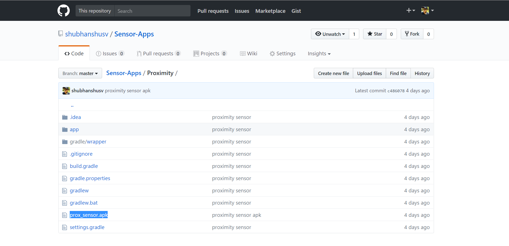

# Sensor-Apps

Android apps related to various smartphone sensors

## 1. Proximity Sensor

A proximity sensor is a sensor able to detect the presence of nearby objects without any physical contact.
 Proximity sensors are commonly used on smartphones to detect (and skip) accidental touchscreen taps when held to the ear during a call.

### How to get the app?

1. Visit https://github.com/shubhanshusv/Sensor-Apps/tree/master/Proximity
2. Download the apk file as highlighted below, and install on an android smartphone.

