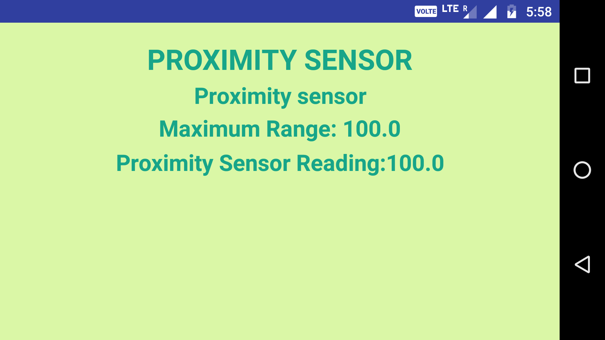

# Sensor-Apps

Android apps related to various smartphone sensors

## 1. Proximity Sensor

A proximity sensor is a sensor able to detect the presence of nearby objects without any physical contact.
 Proximity sensors are commonly used on smartphones to detect (and skip) accidental touchscreen taps when held to the ear during a call.

### How to get the app?

1. Visit https://github.com/shubhanshusv/Sensor-Apps/tree/master/Proximity
2. Download the apk file as highlighted below, and install on an android smartphone.

### Overview

1. After launching the app, the main screen looks like this (landscape mode).

2. The heading (1st line) is just the indicator of which sensor is used.
3. The 2nd line indicates name of proximity sensor of your smartphone.
4. The 3rd line tells the max. value that proximity sensor reading may reach.
5. The 4th line tells the reading of proximity sensor of your smartphone.

- Proximity Sensor is generally located near the front facing camera of the smartphone.
- The reading of proximity Sensor varies from smartphone to smartphone. 
- It generally outputs some values (2-3 different values), which are indicative of distance of object from smartphone.
- For example, In moto g4plus, the reading of proximity sensor is either 1,3 or 100. 1 indicates that object is 1cm away from proximity sensor , similarly 3 indicates 3cm. For distance more than 3cm, it just outputs 100.

